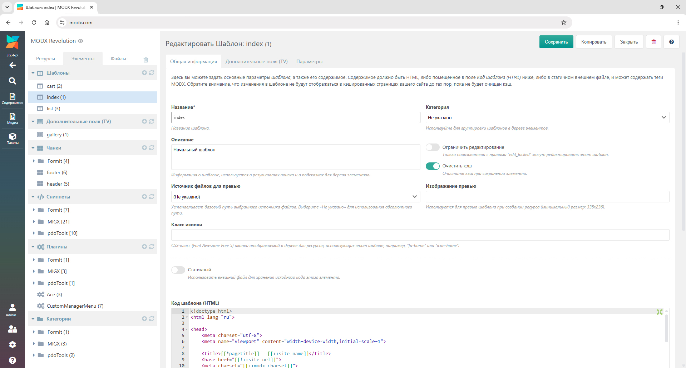

# MODX 3 → MODX 2 Style

Плагин, который стилизует админ-панель MODX 3 под классический стиль MODX 2.
Возвращает привычный градиент шапки, старые акцентные цвета кнопок, ссылок и элементов интерфейса.

## Что меняется

- Градиентный фон верхней панели (как в MODX 2)
- Бирюзовые кнопки в стиле старой админки
- Цвета ссылок и дерева ресурсов
- Стили чекбоксов
- Акценты на дашборде

Фронтенд сайта не затрагивается — изменения только в менеджере.

## Совместимость

- MODX 3.0 – 3.1+

## Установка

1. Создайте новый плагин:  
   **Элементы → Плагины → Создать плагин**
2. Название: `CustomManagerModx` (или любое другое)
3. Вставьте код из файла `CustomManagerModx.php`
4. На вкладке **Системные события** включите:    - `OnManagerPageInit`
5. Сохраните плагин.

После этого обновите страницу менеджера (Ctrl+F5).

